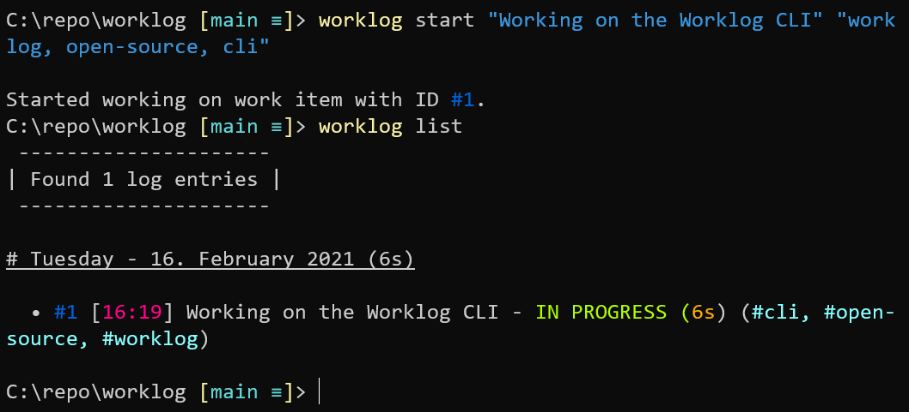

# Worklog

> This project is kind of **work in progress** at the moment.
> Nevertheless feel free to take a look or try it!

Simple CLI application written in Rust for me to be able to keep track of times spend on work items.

## Usage

Currently, we only have a command line interface and no pre-built binaries.
So you need to build the application yourself using a Rust toolchain (Which we do not cover here -> See [here](https://www.rust-lang.org/).

Build the application with `cargo build --release` and find the built executable under `target/release/` named `cli.exe` or just `cli` depending on your platform.
Place the executable file somewhere you prefer and add it to your `PATH` environment variable.
I also rename the executable to `worklog`.

Then you'll be able to call `worklog` from the command line.
Type `worklog --help` to see all available options.
Subcommands like `worklog log` are further described using `worklog log --help`.

Note that `worklog list` will only show all logged work items of the current day by default.
To see all work items pass `--all` to the command.
You may also filter by a specific day using `worklog list --filter today`, `worklog list --filter yesterday`, `worklog list --filter 2021-01-31`.

## Commands

Some information about individual sub-commands available to the CLI.

| Sub-command | Description | Example |
| --- | --- | --- |
| `start` | Start working on a new work item | `worklog start "DESCRIPTION" "tag1, tag2, tag3" --pause` (`--pause` will pause all currently in progress work items. `--finish` is also available.) |
| `finish` | Finish working on an existing work item | `worklog finish 3` (Will finish work item with ID 3) |

## Background information

The logged work is stored in a SQLite database file located under `~/.worklog/logs.db`.
So when you want to reset your work, you can just delete the file.
